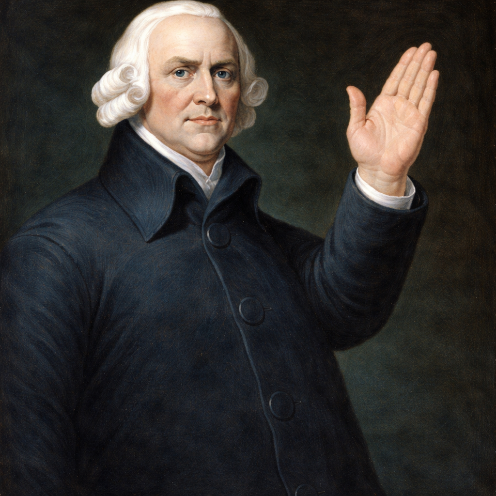
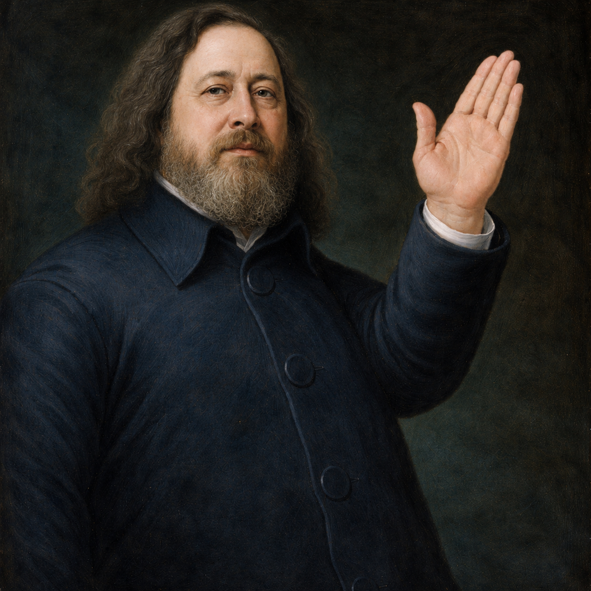

<!-- _class: title -->
# The Age of Corporate Nihilism

<!--
“We live in an age where products get worse, services degrade, and yet the institutions behind them become larger and more powerful.”

pause

“That should not happen in functioning markets.”

Services get shitter.

“Corporate nihilism is when institutions become structurally detached from the long-term wellbeing of the people they affect.”

We will look at some historical context, and how the context that capital operates within alters how it behaves.

I always try to use the dialectic to discover truth, rather than rehteroic, challenging ideas through dialogue and accepting what i think is true, is probably wrong.

-->

---

# Capital in Context

## Adam Smith’s Invisible Hand

- local industrialists
- reputation mattered
- communities mattered
- failure was possible
- capital remained geographically and socially constrained

<!--
[talk about Adam Smith and the original invisible hand, capital in context with British industrialists.]

“The invisible hand only works when capital remains exposed to real market consequences, and those with capital are beholden to the communities they exist within.

how that concept becanme generalised.”
-->

---

# Robert Owen

- Welsh mill owner
- Bought New Lanark Mills
- Highly profitable
- Abolished child labor in his Mill
- Created the world’s first infant schools
- Invested in worker education and literacy
- Pioneer of worker wellbeing and productivity

<!--

emphasized cleanliness and public health
invested in worker education and literacy
"Robert Owen was a Welsh mill owner who bought New Lanark Mills and made them highly profitable, not by exploitation, but by abolishing child labor and creating the world’s first infant schools, and basically pioneering agile work methodologies 200 years before agile was a word."

"Owen is often thought of as a founding father of the utopian socialist movement, but he can actually be thought of as a really good capitalist, who realised a happy workforce produces more output."
-->

---

# Detached Capital
## East India Company

> “A corporation has neither a soul to be damned, nor a body to be punished.”
> — Edward Thurlow

- quasi-state corporation
- regulatory capture
- monopoly privileges
- too big to fail (£1.4m / ~£28bn bailout)

<!--
"East India Company went on an immoral rampage through India, pillaging its wealth from 1600 up until the 1780s — state-sponsored corporate terrorism / wealth extraction."

"BTW the British government enacted the Tea Act shortly afterwards, to give the East India Co. monopoly rights over selling tea to America.

Which is why the barrels of tea thrown into the river had the East India Co. stamp. The Boston Tea Party was less a revolt against the British and their tea obsession, and more a revolt against state capitalism and monopoly over the tea trade — of course sparking the American Revolution."
-->

---

## Corporations and the enshittification of capital

- abstract financial capital
- globalised ownership
- no accountability
- regulatory arbitrage
- detached from consequences
- no proximity to workers

---

# Capital as a Spectrum

## High time preference capital
vs
## Low time preference capital

- productive vs extractive
- embedded vs detached
- long-term vs short-term incentives

<!--
“It’s okay not to defend all capitalism with the same rigor.
and to accept the paradigm of the international corporations is a new phenomom. The power to lobby regulatory moat to keep competition out.”

“Crony capitalism and high time preference capital optimise for short-term extraction and regulatory capture.”

“Low time preference capital builds products and systems that endure.”
-->

---

# Helping capital to find context

<!--
“The austrian school would say reducing or destroying state completly fixes capital, I agree. Howver I also beleive capital uses whatever tools to grow. Tools in can to grow. Simply reducing State may not be enough.
-->

---

# Permissionless vs Permissioned Systems

- regulation stifles innovation
- capital adapts to incentives
- capital uses regulation strategically

<!--
(anecdotal comparison of fiat providers vs bitcoin funding sources)

“Capital adapts to incentive structures — including regulatory ones.”

(anecdotal example of myself thinking of regulated services LNbits Inc could offer to get the "edge" over competing services)
-->

---

# The Guiding Hand of FLOSS

## FLOSS / Bitcoin as re-embedded international capital

- reputational constraints
- exit options
- transparency
- forkability
- competitive pressure
- ecosystem accountability

<!--
- accountable to users
- accountable to ecosystem
- accountable to FLOSS project itself

“FLOSS re-contextualizes capital because companies become accountable to open ecosystems. LNbits / Bitcoin / Nostr.”

“Our decisions become guided again by Adam Smith’s invisible hand.”
-->

---

# State Becoming Superfluous?

<!--
"With enough tooling, FLOSS, and AI, the apparatus of the State just simply becomes less neccesary.

"Although I do personally like a welfare safety net, universal access to education and healthcare, parks, and of course muh roads."

"In the UK we are all children of the NHS, but do you know where that came from? Nye Bevan, Tredegar, friendly societies, miners' surplus welfare."

"The socialist tradition traditionally had a strong anti-state sentiment from Kropotkin (Mutual Aid: A Factor of Evolution), Joseph Proudhon (the first anarchist), and Mikhail Bakunin (who predicted Marx’s proletariat revolution would create the red bureaucracy and horrors we saw in the USSR / Communist China)."

"So perhaps we can get rid of the State but keep muh roads. Mises and Hayek believed a teeny tiny state was okay, right? It was Rothbard and the anarcho-capitalists who moved the Austrian school toward no state."

"With no state, or a teeny tiny state, crony capitalist monopolies break apart and the market adopts those permissionless properties again."
-->

---

# AI Nihilism and Wage Labor Displacement

> "government should provide a financial 'backstop'" (too big to fail)  
> ~ Sarah Friar, OpenAI CFO

<!--
AI industry will prob implode, the cap-ex is huge, data centers arent being built, tokjens are siubsidised by vcs (cost with profit is prob x5 current price), models become more costly to train

"OpenAI CFO Sarah Friar said government should provide a financial 'backstop' / 'too big to fail', which probably means it should fail — or at least humanity needs time to adjust."

The threat of of broken markets

"The rhetoric from AI companies to venture capitalists is kinda this: 'invest in our company, because we will create AGI and destroy all jobs.' So we see a hysteria in venture capital throwing money into a bottomless pit."

which is funny

"Marx believed that the contradictions of the capitalist mode would eventually make it consume itself. In capitalism you need wage labor to have consumers to buy the things."

-->

---

# AI Changes Coordination Costs

## Corporations as FLOSS

- Meta: $925,000–$960,000 profit per employee
- Apple: $675,000 profit per employee

<!--
"With Nostr, Bitcoin, FLOSS, and AI, it’s not that hard to imagine a different mode of capital competing in the market."

"With microtransactions money can flow at the speed of light throughout organisations. One of the more interesting breakthroughs we had early on in LNbits was the invention of payment splits. When you can move tiny amounts of money through a network for low cost, the rails themselves could change how money flows through an organisation, making it more efficient."

"These are extreme examples in highly profitable corporations, but with Meta’s median salary of $270k–$280k, the concept of that bumping to +$1m is a heck of an incentive, especially when you see the repeated poor business decisions of Zuckerberg."

"Perhaps having a Zuckerberg or a Bezos extracting huge wealth isn’t the most efficient use of the capital production creates. Perhaps richer employees will be happier and produce more."

-->

---

# bitcoin upgrade + vibing Capital

- SMEs become cheaper to run
- AI lowers coordination costs
- faster experimentation
- gonzo development
- lower barriers to entry
- reduced wealth disparity creates demand

<!--

# What Do Higher Paid Jobs Actually Do?

- allocating capital
- coordinating labor
- directing strategy
- managing incentives
- deciding where resources flow

"Many of the higher paying jobs in a corporation exist around... something AI is good at."
Regardless of being dependent on AI

Split payments

-->
---

# The Synthesis (possible utopian Equilibrium)

- crony capitalist corpscorps are outcompeted by massive coops in the free market
- there’s more wealth sloshing about (without fiddling interest rates), so trickle-down actually works
- plenty of opportunity for local industrialists
- capital finds context, reinvested into local communities
- perhaps that tiny State apparatus for "muh roads" is also mostly AI and some crowdfunded labor
- capital de-enshittifies
- ancaps are happy because the market is full of lots of competing capital
- soya commies are happy because they get cooperatives for hyperscaled globalised capital
- we all skip into the sunset holding hands
<!--
Hegels dialectic looked at one question, how do things get better, they generally do.

Its quite possible corp capital will be disrupted in the same way broken state apparatus designed 100s of years ago, like representative democracy, transcending into purer forms of cpikatlism and direct democracy.

We're probably not and the end of history and the words of the anarchists a better world is possible.

-->
